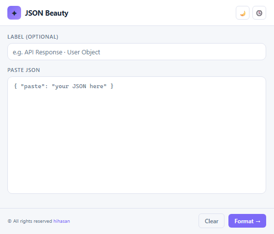
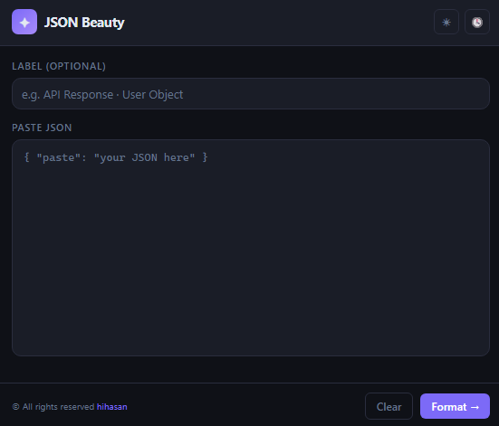

<div align="center">


# JSON Beauty

**A Chrome extension to paste, format, and browse your JSON — right from the toolbar.**


</div>

---

## Features at a Glance

| | Feature | Description |
|---|---|---|
| ✦ | **Instant formatting** | Render any JSON as a collapsible, colour-coded tree in one click |
| 🎨 | **Colour-coded tokens** | Keys, strings, numbers, booleans, and nulls each have a distinct colour |
| 🔍 | **Search** | Find keys and values instantly; navigate matches with `↑` / `↓`; collapsed nodes expand automatically |
| ✏️ | **Inline editing** | Double-click any value to edit it in place without re-parsing |
| 🔄 | **JSON → Model converter** | Generate Kotlin, Java, Swift, or Flutter/Dart model classes with one click — copy or download |
| 📂 | **Persistent history** | Up to 50 past entries saved locally; survive browser restarts |
| 🗂 | **Auto-labelling** | Entries are titled automatically from JSON content or set manually |
| ⎘ | **One-click copy** | Copy pretty-printed JSON or generated model code to clipboard |
| 🗑 | **History management** | Delete individual entries on hover, or clear all at once |
| 🌗 | **Light / Dark theme** | Toggle between themes from any screen |

---

## Introduction

JSON Beauty is a minimal Chrome extension that turns raw JSON into a readable, collapsible tree — no tab-switching, no external tools, no internet required. Paste your payload, hit **Format**, and get a colour-coded viewer with full collapse/expand support. Every entry is saved locally so you can revisit past responses without re-pasting.

<table>
  <tr>
    <td></td>
    <td></td>
    <td></td>
  </tr>
</table>

---

## Features

- ✦ **Instant formatting** — paste any valid JSON and render it as a collapsible tree in one click
- 🎨 **Colour-coded tokens** — keys, strings, numbers, booleans, and nulls each have a distinct colour
- 🔍 **Search by key & value** — type in the viewer search bar to highlight all matching keys and values; navigate matches with `↑` / `↓` buttons or `Enter` / `Shift+Enter`; collapsed sections expand automatically to reveal matches
- ✏️ **Inline editing** — double-click any value in the tree to edit it in place; changes reflect instantly without re-parsing
- 🔄 **JSON → Model converter** — convert any JSON to typed model classes in four languages:
  - **Kotlin** — `data class` with `kotlinx.serialization` (`@Serializable`, `@SerialName`); toggle `@Serial`, `Nullable`, `var`
  - **Java** — POJO with Jackson or Gson annotations, optional getters; toggle annotation style
  - **Swift** — `struct`/`class` with `Codable`; `CodingKeys` generated only when key renaming is needed
  - **Flutter / Dart** — classes with `fromJson` factory and `toJson` method
  - Set a **package / module name** for each language; copy or download the output file
  - Accessible via **Convert To Model →** on the input screen or the **Kt** button in the viewer header
- 📂 **Persistent history** — up to 50 past entries stored locally via `chrome.storage.local`, survive browser restarts
- 🗂 **Auto-labelling** — entries are automatically titled from your JSON content (e.g. `Object {name, id, type}`) or you can set your own label
- ⎘ **One-click copy** — copies the pretty-printed JSON to your clipboard from the viewer
- 🗑 **History management** — delete individual entries on hover, or clear everything at once

---

## How to Install

> The extension is not on the Chrome Web Store. Install it manually in Developer mode.

**Steps:**

1. Download or clone this repository and unzip it
   ```bash
   git clone https://github.com/your-username/json-beauty.git
   ```

2. Open Chrome and navigate to the extensions page
   ```
   chrome://extensions
   ```

3. Enable **Developer mode** using the toggle in the top-right corner

4. Click **Load unpacked** and select the `json-beauty` folder

5. Pin the extension from the Chrome toolbar — look for the purple `{}` icon

---

## Usage

1. Click the **JSON Beauty** icon in the Chrome toolbar
2. *(Optional)* Type a label for the entry in the **Label** field
3. Paste your JSON into the text area
4. Click **Format →** to open the tree viewer, or **Convert To Model →** to jump straight to the model converter
5. In the viewer, use the **search bar** to find keys or values — step through matches with `↑` / `↓` or `Enter` / `Shift+Enter`
6. **Double-click** any value to edit it inline
7. Click **Kt** in the viewer header to open the model converter for the current entry
8. In the converter, pick a language tab (Kotlin / Java / Swift / Flutter), set options and an optional package name, then **⎘ Copy** or **⬇ Download** the generated code
9. Click the **🕓** clock icon at any time to browse your history

---

## License

GNU GENERAL PUBLIC LICENSE © [Hihasan](https://hihasan.xyz/)